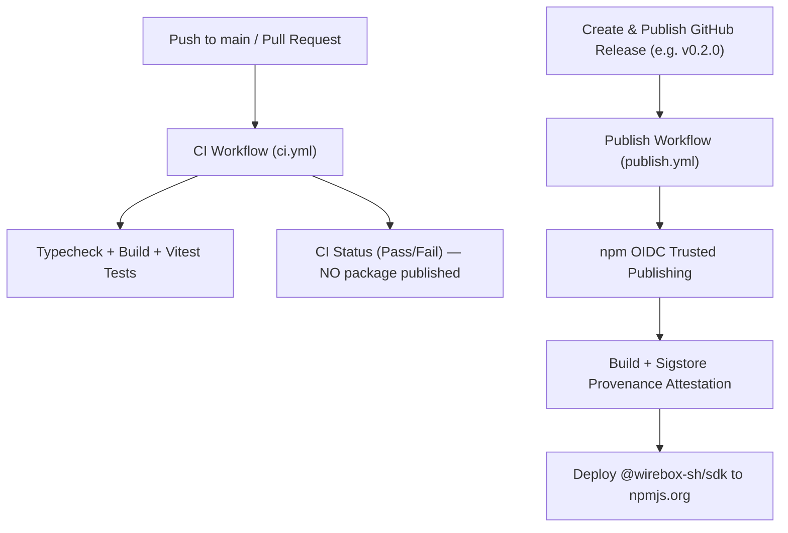

# AGENTS.md

> Guidance and instructions for AI coding agents working on the **`wirebox-typescript`** codebase (`@wirebox-sh/sdk`).

---

## 1. Project Overview

`wirebox-typescript` is the official TypeScript/JavaScript SDK for **Wirebox** — the real-world identity, communication, and context execution layer for AI agents.

- **npm Package**: [`@wirebox-sh/sdk`](https://www.npmjs.com/package/@wirebox-sh/sdk)
- **GitHub Remote**: `git@github.com:wirebox-sh/wirebox-typescript.git`
- **Primary Stack**: TypeScript 5+, `tsup` (dual ESM + CJS + DTS bundling), `vitest`
- **Key Modules**:
  - `Wirebox`: Root client entrypoint
  - `AgentIdentity`: Digital persona, mailbox, phone number, and tunnels
  - `TunnelsClient`: Live WebSocket tunnel management & local port forwarding
  - `WebhooksClient` & `verifyWebhook`: Webhook subscriptions & HMAC-SHA256 signature verification

---

## 2. Directory Structure

```text
wirebox-typescript/
├── .github/
│   └── workflows/
│       ├── ci.yml          # CI: Typecheck, build, vitest tests on push/PR to main
│       └── publish.yml     # Release: npm OIDC Trusted Publishing on GitHub Release
├── src/
│   ├── index.ts            # Public library exports
│   ├── client.ts           # Wirebox root client
│   ├── identity.ts         # AgentIdentity domain model & mailbox methods
│   ├── tunnels.ts          # WebSocket tunnels client & relay protocol
│   ├── webhooks.ts         # Webhooks management client
│   ├── verify_webhook.ts   # Webhook HMAC-SHA256 signature verification
│   ├── credentials.ts      # API key resolution
│   ├── errors.ts           # Typed error hierarchy
│   ├── http.ts             # Fetch-based HTTP transport
│   └── types.ts            # TypeScript interfaces & request/response types
├── tests/                  # Vitest test suites (52+ tests)
├── package.json            # Package metadata, exports, and dependencies
├── tsup.config.ts          # Dual ESM/CJS build configuration
└── tsconfig.json           # TypeScript configuration
```

---

## 3. Development Commands

Always run commands inside the `wirebox-typescript/` directory:

| Task | Command | Purpose |
| :--- | :--- | :--- |
| **Typecheck** | `npm run typecheck` | Run static type checking (`tsc --noEmit`) |
| **Build** | `npm run build` | Bundle ESM, CJS, and `.d.ts` definitions via `tsup` |
| **Test** | `npm test` | Run all Vitest unit tests |
| **Watch Tests** | `npm run test:watch` | Run Vitest in interactive watch mode |
| **Pre-publish** | `npm run prepublishOnly`| Automatically builds dist prior to packing/publishing |

---

## 4. Version Management Policy

The SDK strictly follows **Semantic Versioning (SemVer)**: `MAJOR.MINOR.PATCH`.

- **Source of Truth**: [`package.json`](package.json) (`"version": "x.y.z"`).
- **Synchronized Lockfile**: Whenever the version is changed, [`package-lock.json`](package-lock.json) must be updated in lockstep.

### Version Bump Procedure
```bash
# Update version in package.json and package-lock.json simultaneously:
npm version <x.y.z> --no-git-tag-version

# Example for a patch release:
npm version 0.2.1 --no-git-tag-version

# Example for a minor release:
npm version 0.3.0 --no-git-tag-version
```

---

## 5. CI/CD & npm Release Workflow

The repository separates continuous integration from release publishing:



### 5.1 Why Pushing to `main` Does NOT Publish
- Pushes to `main` trigger **only** [`.github/workflows/ci.yml`](.github/workflows/ci.yml).
- This ensures regular development, documentation updates, and PR merges never accidentally publish incomplete packages to npm.

### 5.2 npm Trusted Publishing (OIDC)
- The package uses npm **Trusted Publishing** (OpenID Connect).
- No long-lived `NPM_TOKEN` secret is stored in the repository.
- Authentication happens via short-lived OIDC tokens generated by GitHub Actions (`permissions: id-token: write`).
- Every published version automatically receives cryptographic provenance attestations recorded in the public Sigstore transparency log.
- **Environment Requirement**: Runner must use Node 22 and `npm install -g npm@latest` (npm >= 11.5.1 required for OIDC). Do **not** pass `registry-url` to `actions/setup-node` as it injects an empty auth token that blocks OIDC authentication.

### 5.3 Step-by-Step Release Guide

To release a new version to npm:

1. **Verify Local Quality**:
   ```bash
   npm run typecheck && npm run build && npm test
   ```
   Ensure all 52+ tests pass with zero errors.

2. **Bump Version**:
   ```bash
   npm version <x.y.z> --no-git-tag-version
   ```

3. **Commit and Push to `main`**:
   ```bash
   git add package.json package-lock.json
   git commit -m "chore(release): bump version to <x.y.z>"
   git push origin main
   ```
   Wait for CI to turn green on GitHub.

4. **Trigger Release via GitHub CLI**:
   ```bash
   gh release create v<x.y.z> --title "v<x.y.z>" --notes "<release description>"
   ```
   *(Alternatively, publish a Release from the GitHub web UI).*

5. **Verify on npm**:
   ```bash
   npm view @wirebox-sh/sdk version
   ```

---

## 6. Development & Coding Rules

1. **Strict Types**: Never use `any`. Use discriminated unions, strict error types, and explicit return types for public SDK methods.
2. **Backward Compatibility**: Public exports in [`src/index.ts`](src/index.ts) must maintain stability across minor and patch versions.
3. **No Unverified Commits**: Follow the project golden rule: never commit until build, typecheck, and test suites are fully verified locally.
